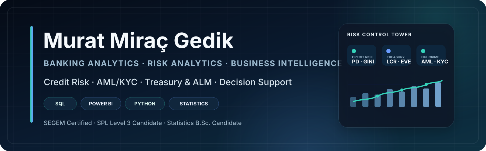

  

  <strong>Statistics Student · Data Analyst & BI Analyst Candidate · E-Commerce Founder</strong>

  <a href="https://www.linkedin.com/in/muratmiracgedik/">LinkedIn</a>
  ·
  <a href="mailto:muratmiracg@gmail.com">Email</a>
  ·
  <a href="https://github.com/muratmiracg-dev?tab=repositories">All Repositories</a>

  <em>Open to Data Analyst, BI Analyst, Reporting Analyst, and data-oriented Business Analyst opportunities.</em>

## About Me

I am a Statistics student at Süleyman Demirel University, building my career
at the intersection of **data analytics, business intelligence, forecasting,
and process improvement**. I use SQL, Power BI, Python, Excel, DAX, and Power
Query to convert raw data into reliable models, clear dashboards, and
decision-ready insights.

Since 2020, I have founded and managed **Monaco Luxe Clothing**, a bootstrapped
e-commerce venture generating more than **TRY 100,000 in annual revenue**. I
oversee performance marketing, pricing, purchasing, inventory planning,
customer experience, and supplier coordination. This experience helps me
connect analytical methods with real commercial decisions, operational
constraints, and measurable outcomes.

My portfolio focuses on end-to-end business cases rather than isolated
notebooks. Each featured project includes analytical code, structured data,
business KPIs, reproducible documentation, and stakeholder-facing outputs such
as Power BI reports, Excel models, presentations, or executive reports.

> **Transparency:** Portfolio datasets and financial outcomes are synthetic
> unless a repository explicitly states otherwise. Assumptions, limitations,
> and validation methods are documented within each project.

## Featured Analytics Projects

| Project | Business question | Selected evidence |
|---|---|---|
| [CRM Sales Analytics & Business Intelligence](https://github.com/muratmiracg-dev/crm-sales-analytics-bi-dashboard) | Where are the largest revenue, funnel, pipeline, and sales-performance gaps? | 36 months of CRM data; 18,206 annual leads; TRY 27.80M synthetic 2026 revenue; Power BI, DAX, Power Query, Tableau, and Excel |
| [E-Commerce Demand Forecasting & Inventory Optimization](https://github.com/muratmiracg-dev/ecommerce-demand-forecasting-inventory-optimization) | How much should the business buy, when should it order, and how much capital is required? | 60 SKUs; 52-week forecast; 15.7% average champion WAPE; four planning scenarios; Python, SQL, Power BI, and Excel |
| [Integrated FP&A, Budgeting & Scenario Planning](https://github.com/muratmiracg-dev/integrated-fpa-budgeting-forecasting-scenario-planning) | What is the updated financial outlook, and how resilient are EBITDA and cash? | 42 months of actuals; 18-month rolling forecast; four scenarios; 5,000-trial Monte Carlo simulation; Power BI, Excel, SQL, and Python |
| [Enterprise Process Mining & Workflow Optimization](https://github.com/muratmiracg-dev/Enterprise-Process-Mining-Intelligent-Workflow-Optimization) | How does work actually flow, where do delays occur, and which interventions improve SLA performance? | 12,000 cases; 166,551 events; BPMN conformance; SLA-risk modeling; capacity simulation; PM4Py, PostgreSQL, FastAPI, and Power BI |

## Analytics Focus

| Business Intelligence | Advanced Analytics | Business & Process Analysis |
|---|---|---|
| KPI frameworks and executive reporting | Forecasting and model comparison | Requirements and stakeholder needs |
| Semantic modeling and DAX | Scenario and Monte Carlo analysis | AS-IS / TO-BE process thinking |
| Power Query and data transformation | Customer, churn, and risk analytics | BPMN, conformance, and bottlenecks |
| Sales, finance, and operations dashboards | Explainability and model validation | Acceptance criteria and decision support |

## Technical Toolkit

| Area | Tools and methods |
|---|---|
| Data and querying | SQL, PostgreSQL, SQLite, Microsoft Excel, Power Query |
| Analytics and modeling | Python, pandas, NumPy, scikit-learn, statsmodels, PM4Py |
| Business intelligence | Power BI, DAX, PBIP, Tableau, semantic modeling |
| Business domains | Sales and CRM, e-commerce, FP&A, inventory, process analytics |
| Delivery and quality | Git, GitHub Actions, Pytest, FastAPI, Docker, documentation |

## Experience & Education

- **Founder & E-Commerce Operations Manager — Monaco Luxe Clothing**
  (2020–Present): performance marketing, pricing, purchasing, inventory,
  customer experience, and supplier coordination.
- **Volunteer Business Analyst — Industry and Quality Society**
  (2025–2026): requirements gathering, process analysis, KPI reporting,
  stakeholder coordination, and operational planning.
- **BSc in Statistics — Süleyman Demirel University**
  (Expected graduation: June 2027).
- Professional training in **Financial Reporting** from the University of
  Illinois Urbana-Champaign and **Entrepreneurship Strategy** from HEC Paris.

## Selected Professional Development

KOSGEB Entrepreneurship Training · Türkiye İş Bankası ProSchool Data & AI
Class · Borusan Holding Technology School · DenizBank Data Science and
Artificial Intelligence BootCamp · Huawei Cloud DevOps Bootcamp · Vodafone
Summer Campus · Financial Literacy Level 3 (SPL Certificate)

## Beyond Analytics

I have also developed portfolio work in cloud-native engineering, DevSecOps,
AIOps, FinOps, explainable credit risk, manufacturing quality, predictive
maintenance, and geospatial site selection. These projects strengthen my
understanding of how analytics solutions are engineered, governed, tested, and
communicated across different business environments.

## What I Am Looking For

I am interested in opportunities where I can combine statistical thinking,
business ownership, and clear communication to support better decisions:

- Data Analyst
- Business Intelligence Analyst
- Reporting Analyst
- Sales, CRM, Finance, or Operations Analytics
- Data-oriented Business Analyst

  <strong>Let’s connect and turn business questions into measurable decisions.</strong>

  <a href="mailto:muratmiracg@gmail.com">muratmiracg@gmail.com</a>
  ·
  <a href="https://www.linkedin.com/in/muratmiracgedik/">linkedin.com/in/muratmiracgedik</a>

